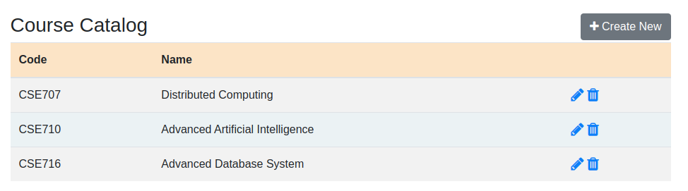
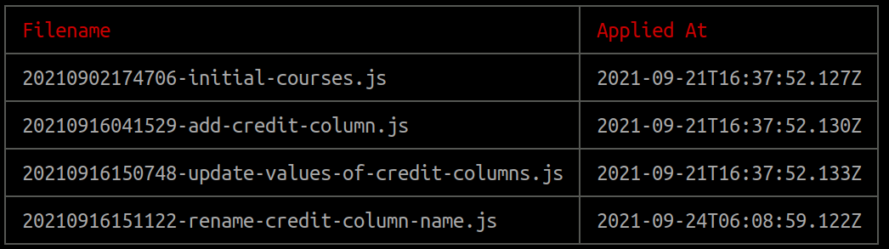

# Mongo Migrator
[](https://opensource.org/licenses/MIT)
This is a project to show how mongodb migration works. This project has been built using expressjs. To make the migration work easier a library 
named **migrate-mongo** has been used. For more details follow this [https://github.com/seppevs/migrate-mongo#readme]([https://github.com/seppevs/migrate-mongo#readme)

# Running the project
This project has a GUI to show the data. Following applications/software/library needs to be installed as a prerequisite to run the GUI:

```
1. Mongodb
2. npm
```

For this project we expect that mmongodb to be installed and run on port 27017. If you have remote database running on different ports
then change the configuration of [databse.js](https://github.com/sajol/mongo-migrator/blob/main/model/database.js)

Now clone the project. Go to the project directory. Then run the following command:
```
npm install
```

If everything works fine then you should see the following output:
```
Express server started at port : 3000
Connection successful.
```
 
Now open your browser and go to this url http://localhost:3000/course/list. 

This won't show anything at this moment because we have not applied any migration. So the database is empty. Run the
following command to see the course list:

```
migrate-mongo up
```

Then again try to access this url http://localhost:3000/course/list. Now you should be able to see something like below:




From the ui it will be possible to edit, update and delete any courses as well.

## Handling migration using [migrate-mongo](https://github.com/seppevs/migrate-mongo#readme)

Any descent migration tools should be able to:

1. Create migration
2. Upgrade migration
3. Downgrade migration
4. Show status of the migration

[migrate-mongo](https://github.com/seppevs/migrate-mongo#readme) can handle all these things very easily.

## Create migration

To create a migration file go to this project directory. Then open the terminal and execute the following command:
```
migrate-mongo create <name of the migration>
```

A new migration file will be created in the [migration](./migrations) folder of this project. The file name will start
with the timestamp of the creation time followed by the name and end with `.js`. 
For example: `20210902174706-initial-courses.js`


The migration configuration can be easily changed by modifying the [migrate-mongo-config.js](./migrate-mongo-config.js) file. To change directory simply
modify the _migrationsDir_ property.


## Upgrade migration
After creating the file, it needs to be applied or upgraded. To do that run the following command:

```
migrate-mongo up
```

The logic inside the `up` function will be executed. For example see the files inside [migration](./migrations) folder.


## Downgrade migration
One of the important features of the migration tools is its ability to rollback the current migration and downgrade to 
the last successful migration. To downgrade to the last migration run the following command:

```
migrate-mongo down
```

The logic inside the `down` function will be executed. For example see the files inside [migration](./migrations)
folder, and the schema will be downgraded.


## Migration status
It is also equally important to be able to see all the applied as well as pending migrations at any given time. To see
the status of all the migrations run the following command:
```
migrate-mongo status
```

If the above command is executed inside the project directory then it will show the following report:




